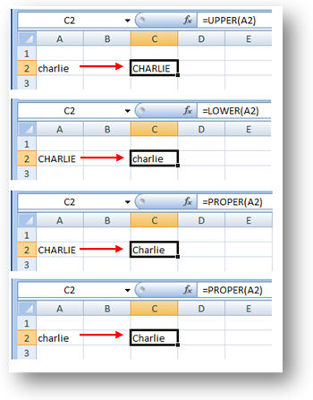

<h1>Excel for Data Analysis</h1>

<h2>Excel Keyboard Shortcuts</h2>

<h2>Data Cleaning</h2>

Data cleaning involves fixes inconsistencies in datasets. The following are some inconsistencies that could be preent in a data set and how to rectify them.

<ol>
  
  <li>
    
<b>Spell Checking:</b>

    
Select what data we wish to check for spelling. Then we click Spelling which is on the Review tab. If there is an error or a name has been misspelt, or more likely, mistyped. We just click Change if we are happy with the spelling suggestion, or we could choose another suggestion from the list, or even ignore this error if we know the data is correct.

  </li>
  
  <li>
    
<b>Check for empty cells:</b>

    
Use <b><code>CTRL+DOWN</code></b> ARROW to check if the there is a split of the dataset (to check for empty rows in the dataset). This could be used to check for empty cells too.

     
There is a much better way - which involves selecting all our data first, either using the mouse, or the <b><code>CTRL+SHIFT+END</code></b> keyboard shortcut. Then we select the Filter icon on the Data tab. Click on the filter icon on a column, uncheck all and check blanks. This shows you all the blank cells in that column.

  </li>
  
   <li>
    
<b>Duplicated rows of data:</b>

    
How to remove duplicate rows.

    
<b><code>METHOD 1</code></b>

    

     Select a column that shouldn't have duplicates and choose Conditional Formatting, then Highlight Cells Rules, and then Duplicate Values. When we click OK, and scroll down the sheet, we wll see that only a few values have been identified as being duplicates. Next step is to delete the duplicated rows of data.
    

    
<b><code>METHOD 2</code></b>

    

     Select the whole datasheet, and on the Data tab, we use the Remove Duplicates button. We then unselect all the columns, then only select the a column which we want to check duplicates for. Click ok to remove or delete the duplicate rows. This method is less secure.
    

    

  
  </li>
  
   <li>
    
<b>Misspelt Names:</b>

    
The <b><code>Find & Replace</code></b> feature to repair some misspelt names. <b><code>Find and Replace</code></b> tools are under Find & Select on the Home tab in Excel. Type the misspelt name into the <b><code>‘Find what’</code></b> box and click <b><code>Find Next</code></b>, then click it again to see there are multiple incorrect entries. If we click <b><code>Find All</code></b>, all instances are listed, and we can open the <b><code>Replace</code></b> tab to enter a name to replace the incorrect spellings.

    </li>
    
    
   <li>
    
<b>Case Inconsistencies:</b>

    

      The <b><code>UPPER, LOWER, and PROPER</code></b> functions can help you change the case of text in your data.  If you want to change from uppercase characters to use proper case then you need to add another row to put the function in; this is referred to as a ‘helper’ row. The <b><code>PROPER</code></b> function is simple to use; you can use SHIFT+RIGHT ARROW to select the columns across to X first then press F2 to bring the cursor into focus in cell A2 then you hold down the CTRL key while you press Enter, and it fills across for you. You might think that you could now remove the original row; but look what happens when you do; you get a REF error because the formula is referencing an invalid reference, and the header row cells now contain just the failed formula rather than the actual header text. So, you need to undo that, and instead, you copy the contents of the helper row to row 1 but when you paste you need to choose the Paste Values option. Now the header row cells just contain header text, and you can remove the helper row in row 2.
    

    

      The <b><code>UPPER</code></b> function is used to change characters to uppercase, while the <b><code>LOWER</code></b> function is used to change characters to lower case.
    
  
    

    </li>
  
  
  <li>
    
<b>Mixture of date formats unsuitable date format:</b>

    

      To apply that new custom date format to the rest of the column you could either use the Format Painter tool, or you can select the rest of the column and choose the new custom format from the Custom list in the Number Format dialog box.
    

  </li>
  
  
  <li>
    
<b>Whitespace:</b>

    

      Use the <b><code>TRIM</code></b> function. The TRIM function is simple to use; just type equals, then TRIM, then open parenthesis, then the cell reference – in this case M2 – then close parenthesis, and press Enter. You can then double-click the Fill Handle symbol to copy this formula down to the remainder of the column. Now you need to copy the contents of the new column N to column M, and remember once again to paste using the Paste Values option. And lastly, you can remove the helper column. 
    

  </li>
  
  <li>
    
<b>Clean data by combining columns into one:</b>

    

      If you want to use the Flash Fill feature to combine these names (First name and Last name) into one name column, you first insert a helper column. Then, in the first row in the new column you enter the full name of the first contact in the format of your choice; for example you might want surname, then a comma, then the forename, or you might want surname, and just an initial, and so on; in this case let’s just enter the name in the standard format of forename then surname with a space between them, and then we press Enter. Next you start typing the second contact’s name in, and you’ll see that Flash Fill displays a preview of the remaining names for you. If you’re happy with what’s in the preview, all you have to do is press Enter, and it fills in the remaining names for you right down the column. It even works when there are two names in one of the columns. Now you can remove the original columns if you no longer need them.
    

  </li>
  
</ol>
