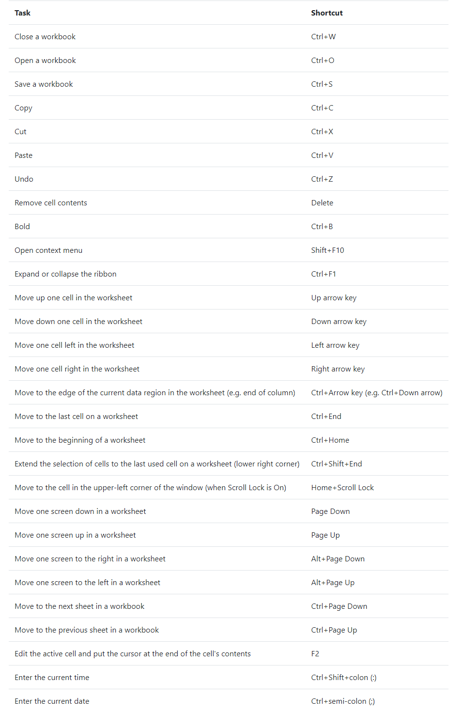

<h1>Excel for Data Analysis</h1>

<h2>Excel Keyboard Shortcuts</h2>

<h2>Data Cleaning</h2>
<ol>
  <li>
    
Spell Checking:

    
Select what data we wish to check for spelling. Then we click Spelling which is on the Review tab. If there is an error or a name has been misspelt, or more likely, mistyped. We just click Change if we are happy with the spelling suggestion, or we could choose another suggestion from the list, or even ignore this error if we know the data is correct.

  </li>
  <li>
    
Check for empty cells:

    
Use <b><code>CTRL+DOWN</code></b> ARROW to check if the there is a split of the dataset (to check for empty rows in the dataset). This could be used to check for empty cells too.

     
There is a much better way - which involves selecting all our data first, either using the mouse, or the <b><code>CTRL+SHIFT+END</code></b> keyboard shortcut. Then we select the Filter icon on the Data tab. Click on the filter icon on a column, uncheck all and check blanks. This shows you all the blank cells in that column.

  </li>
  <li></li>
</ol>
