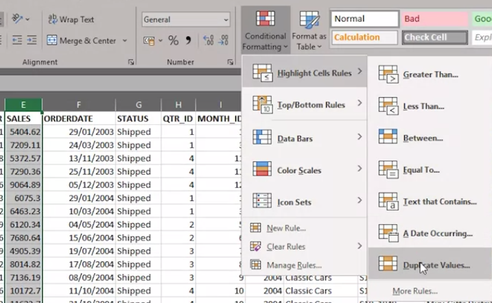

<h1>Excel for Data Analysis</h1>

<h2>Excel Keyboard Shortcuts</h2>

<h2>Data Cleaning</h2>

Data cleaning involves fixes inconsistencies in datasets. The following are some inconsistencies that could be preent in a data set and how to rectify them.

<ol>
  
  <li>
    
<b>Spell Checking:</b>

    
Select what data we wish to check for spelling. Then we click Spelling which is on the Review tab. If there is an error or a name has been misspelt, or more likely, mistyped. We just click Change if we are happy with the spelling suggestion, or we could choose another suggestion from the list, or even ignore this error if we know the data is correct.

  </li>
  
  <li>
    
<b>Check for empty cells:</b>

    
Use <b><code>CTRL+DOWN</code></b> ARROW to check if the there is a split of the dataset (to check for empty rows in the dataset). This could be used to check for empty cells too.

     
There is a much better way - which involves selecting all our data first, either using the mouse, or the <b><code>CTRL+SHIFT+END</code></b> keyboard shortcut. Then we select the Filter icon on the Data tab. Click on the filter icon on a column, uncheck all and check blanks. This shows you all the blank cells in that column.

  </li>
  
   <li>
    
<b>Duplicated rows of data:</b>

    
How to remove duplicate rows.

    
<b><code>METHOD 1</code></b>

    

     Select a column that shouldn't have duplicates and choose Conditional Formatting, then Highlight Cells Rules, and then Duplicate Values. When we click OK, and scroll down the sheet, we wll see that only a few values have been identified as being duplicates. Next step is to delete the duplicated rows of data.
    

    

    
    
<b><code>METHOD 2:</code></b>(This method is less secure)

    

     Select the whole datasheet, and on the Data tab, we use the Remove Duplicates button. We then unselect all the columns, then only select the a column which we want to check duplicates for. Click ok to remove/ delete the duplicate rows.
    

  </li>
  
</ol>
